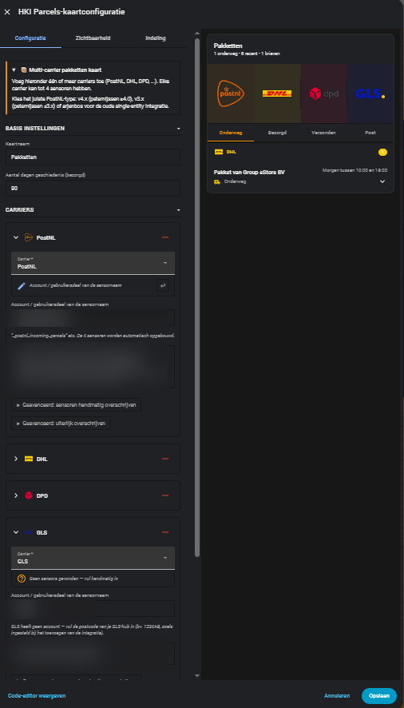

# Screenshots

## Dashboard

---

## Combo banner — multiple carriers

When two or more carriers are configured, the card builds a combo banner from just the carriers you've actually added. Click a logo to open the [carrier overview popup](overview.md#carrier-overview-popup).

---

## Visual editor — carriers

---

## Visual editor — preview

