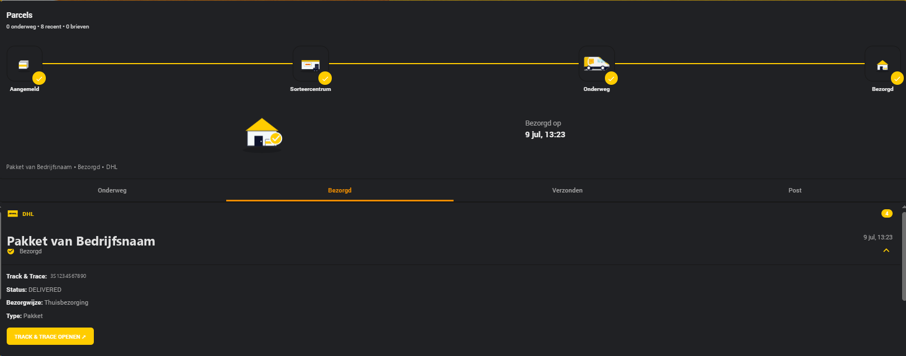
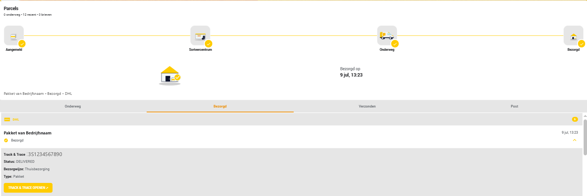
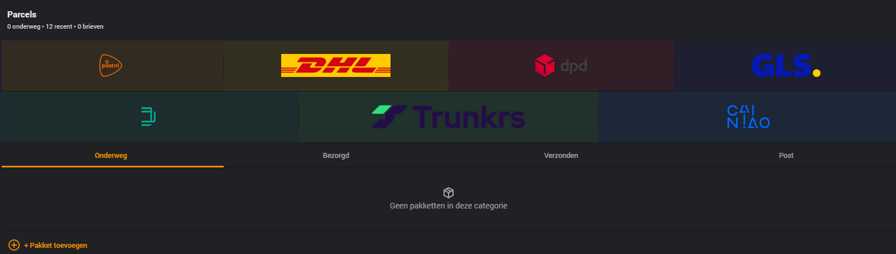
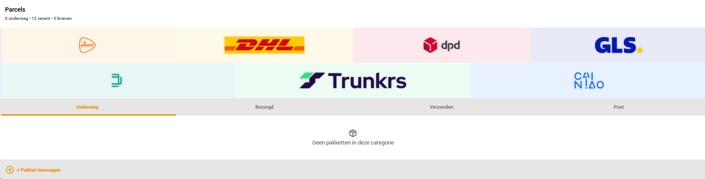
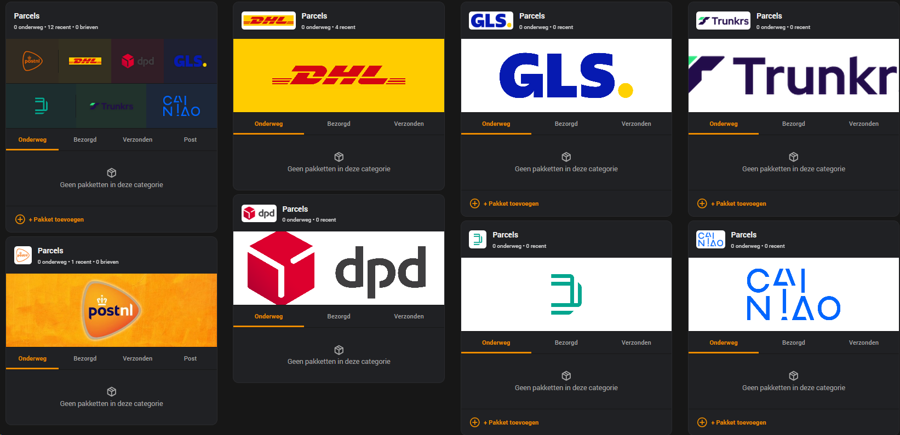
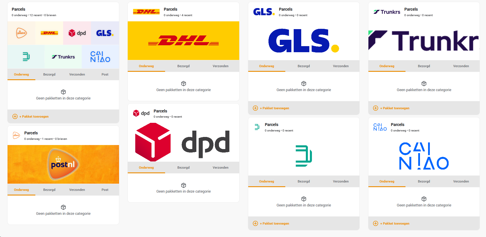
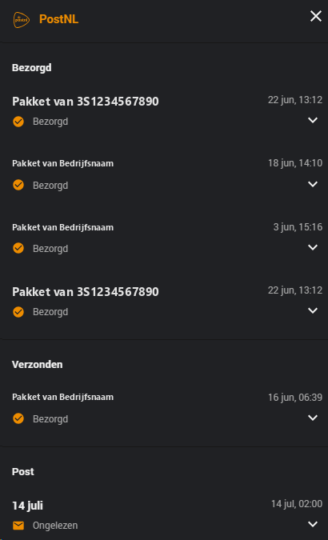
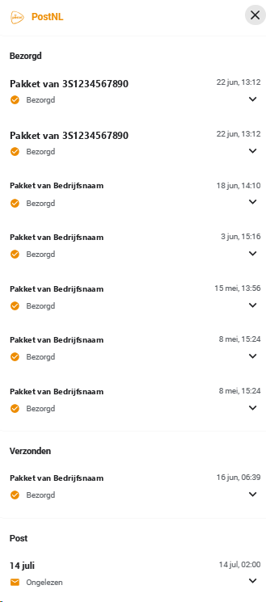
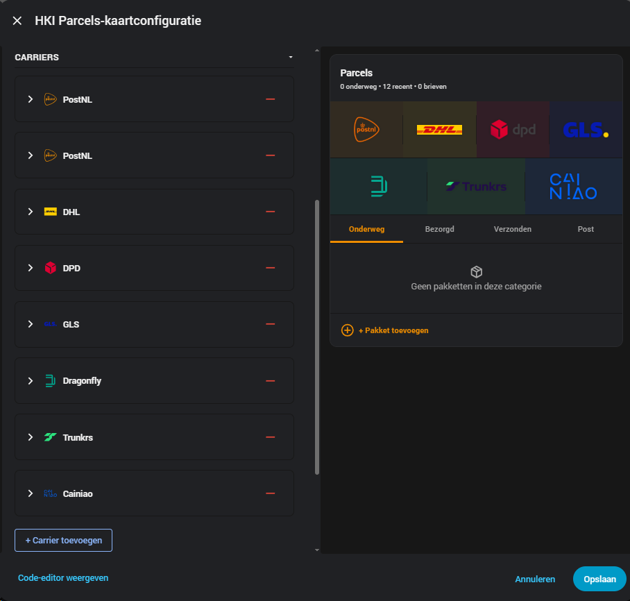

# Screenshots

## Dashboard — parcel detail

The 4-step delivery tracker and expanded parcel detail panel (barcode, status, delivery type, tracking link).

---

## Combo banner — multiple carriers

When two or more carriers are configured, the card builds a combo banner from just the carriers you've actually added, wrapping into multiple rows (capped at 4 per row) once there are more than that.

Full dashboard with every carrier's own tile alongside the combo banner:

---

## Carrier overview popup

Click a carrier's logo in the combo banner to see every parcel and letter for that carrier — grouped by section (In Transit / Delivered / Sent / Post) — in one popup. Clicking an item expands its details in place.

---

## Visual editor

Full carrier list and live preview, side by side — no YAML required.

