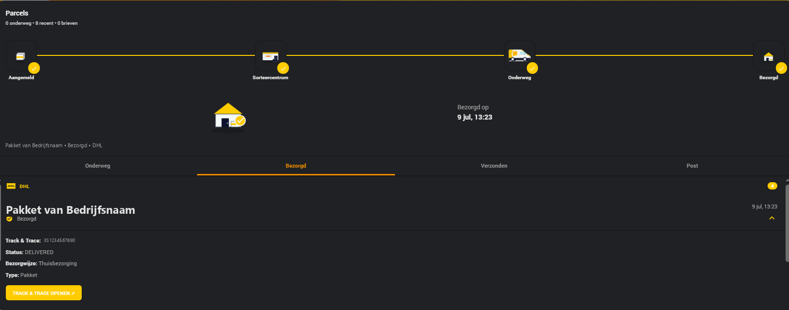

# HA Parcel Card

**Track parcels from all 68 carriers of the ha-parcel-integrations family — PostNL, DHL, DPD, UPS, FedEx, USPS, GLS, bpost, La Poste, Evri and many more — in a single Home Assistant card.**

Automatic sensor detection, animated banners, a 4-step delivery tracker, letterbox mail with scan images, a carrier overview popup, and a complete visual editor — no YAML required.



<div class="grid cards" markdown>

-   :package:{ .lg .middle } **Multi-carrier**

    ---

    Any of the 68 supported carriers side by side. Add the same carrier multiple times for multiple accounts or hubs.

-   :magic_wand:{ .lg .middle } **Auto sensor detection**

    ---

    Enter your account name — the card finds your sensors and fills in all entity IDs automatically, for both known naming schemes.

-   :bell:{ .lg .middle } **Carrier overview popup**

    ---

    Click a carrier's logo in the combo banner to see every parcel and letter for that carrier across all tabs, expandable in place.

-   :heavy_plus_sign:{ .lg .middle } **Add a parcel from the card**

    ---

    Every carrier whose integration has a `track_parcel` service gets a "+ Add parcel" control that registers a tracking number directly.

-   :frame_with_picture:{ .lg .middle } **Media browser**

    ---

    Browse the HA media library from the editor to pick logos, banners and placeholder images.

-   :envelope:{ .lg .middle } **Letterbox mail**

    ---

    PostNL letters with scan images, split into *Still to be delivered* and *Delivered* sections.

</div>

---

## Quick start

=== "PostNL"

    ```yaml
    type: custom:ha-parcel-card
    title: Parcels
    carriers:
      - type: postnl
        user: my_account
    ```

    Requires [ha-postnl](https://github.com/ha-parcel-integrations/ha-postnl) ≥ 4.0.0 — see [Installation](installation.md#postnl).

=== "DHL / DPD / Vinted Go / GLS"

    ```yaml
    type: custom:ha-parcel-card
    title: Parcels
    carriers:
      - type: dhl
        user: my_account
      - type: dpd
        user: my_account
      - type: vinted_go
        user: my_account
      - type: gls
        user: "1234ab"
    ```

    !!! note "GLS has no account"
        GLS tracks parcels by tracking number and postal code rather than a login — `user` maps to the hub's postal code.

    !!! note "Vinted Go is account-based"
        Vinted Go logs in with an e-mail address and a verification link (no password, no tracking-code entry) — like PostNL/DHL/DPD it has no `track_parcel` service, so it doesn't get the card's "+ Add parcel" control. Unlike every account-less carrier below, it tracks both incoming *and* outgoing parcels.

=== "Dragonfly / Trunkrs / Cainiao / Hermes / Packeta / Correos"

    ```yaml
    type: custom:ha-parcel-card
    title: Parcels
    carriers:
      - type: dragonfly
      - type: trunkrs
        user: "1234ab"
      - type: cainiao
      - type: hermes
      - type: packeta
      - type: correos
    ```

    These six (plus GLS) are a sample of the account-less carriers — register a parcel with the "+ Add parcel" control on the card itself instead of logging into an account. See the "Every carrier" tab for the complete list, and [Add parcel support](card/overview.md#add-parcel-support) for how it works.

=== "Every carrier"

    ```yaml
    type: custom:ha-parcel-card
    title: Parcels
    carriers:
      - type: postnl
        user: my_account
      - type: dhl
        user: my_account
      - type: dpd
        user: my_account
      - type: vinted_go
        user: my_account
      - type: gls
        user: "1234ab"
      - type: dragonfly
      - type: trunkrs
        user: "1234ab"
      - type: cainiao
      - type: hermes
      - type: packeta
      - type: correos
      - type: postnord
      - type: sameday
      - type: swiss_post
      - type: planzer
      - type: austrian_post
      - type: helthjem
      - type: dynalogic
      - type: budbee
      - type: nova_post
      - type: delhivery
      - type: sunyou
    ```

Or skip the YAML entirely — add the card via the dashboard UI and it auto-detects every installed carrier integration, pre-filling a fully configured entry for each one it finds.

[Installation :material-arrow-right:](installation.md){ .md-button .md-button--primary }
[Configuration :material-arrow-right:](card/configuration.md){ .md-button }

---

## Supported carriers

All carriers below are part of the [ha-parcel-integrations](https://github.com/ha-parcel-integrations) family — Home Assistant integrations that publish a shared canonical parcel format, which is what lets one card support all of them with the same logic.

The full list — every carrier, its integration, its card `type`, and whether it has a Sent tab, letters and the "+ Add parcel" control — is under **[Carrier types](card/configuration.md#carrier-types)**.

---

!!! note "Part of HKI Elements"
    This card is based on [jimz011/hki-elements](https://github.com/jimz011/hki-elements) — the original PostNL card from the HKI project, extended with multi-carrier support, a carrier overview popup and letterbox mail.
